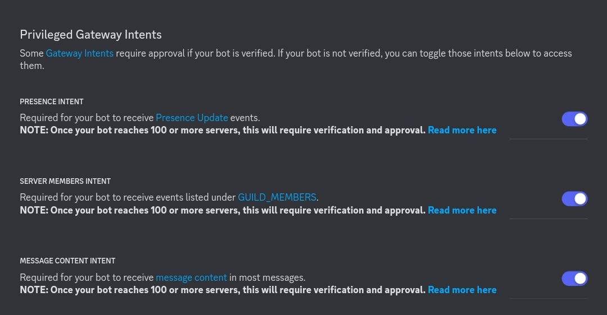

# Setup tutorial
> Here i will explain how to setup the bot on your discord server
## (I) Setup a bot on discord panel
> 1. Go to the [developer dashboard](https://discord.com/developers/applications), and create an application.
>
> 2. In this application, set a name, go in the "bot" category and allow all intents 
>
> 3. Go to the "installation" category, use the method "guild install" with the discord provided link, make sure to allow the administrator right like in this picture 
>
> 4. After you have added your bot to your server, i recommend to setting up the bot state to private (in the "bot" category), for that you will need to set the install link to "none" in the installation category.
>
> 5. Good job, your bot is now on your server!

## (II) Download the code an setup it
> 1. First, download the [src](../src) directory on your workspace.
>
> 2. Make sure you have [node.js](https://nodejs.org/en), after, open a terminal, go to the src directory and run `npm install`, that will download the required node modules used for the bot.
>
> 3. in your src directory, go to the file named `settings.js` and fill all the blankspaces, for the Minecraft account make sure your double authentication is disabled (for information ,the module used is [Mineflayer](https://github.com/PrismarineJS/mineflayer)). 
>
> 4. Open a terminal, run `nodemon .` in the src directory and good job, your bot is now running !
