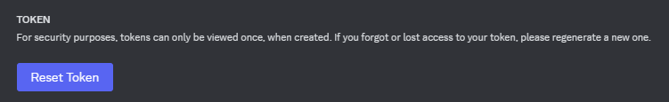

# Setup tutorial

> Here i will explain how to setup the bot on your discord server

## (I) Setting Up a bot on the Discord Developer Portal

> 1. Go to the [developer dashboard](https://discord.com/developers/applications), and create an application.

> 2. In this application, set a name, go in the "Bot" category and allow all intents 

> 3. Go to the "installation" category, use the method "guild install" with the discord provided link, make sure to allow the administrator right like in this picture 

> 4. After you have added your bot to your server, i recommend to setting up the bot state to private (in the "bot" category), for that you will need to set the install link to "none" in the installation category.

> 5. Good job, your bot is now on your server!

## (II) Download the code an setup it

> 1. First, download the github repo on your workspace by using `git clone https://github.com/cocosilex/bridgebot`.

> 2. Make sure you have [docker](https://www.docker.com/) installed.

> 3. in your src/utils directory, go to the file named `settings.ts` and fill all the blankspaces. You need :
>
> - You can also customize the auto-reconnect cooldown, the cooldown between messages sent in-game, the maximum queue size for messages waiting to be sent and if the guild messages should be sent in plain text or with embeds.

> 4. Fill out the .env.template file, for the Minecraft account make sure your double authentication is disabled (for information, the module used is [Mineflayer](https://github.com/PrismarineJS/mineflayer)). You need :
>
> - The discord token, he can be generated here (in the "bot" section on developper portal) : 
> - All of the informations needed about the minecraft account (the email and the password).
> - IDs of the **<ins>Text Channels</ins>** where you want to send messages, you can not set them or set them to "-1" if you want to disable the feature.

> 5. Rename the .env.template to .env

> 6. Open a terminal, run `docker compose up -d`, your bot is now running ! You can see the logs with `docker logs bridgebot` and check the process status with `docker ps`. By the way if some settings/environment variables are incorrect it will be shown in logs !
